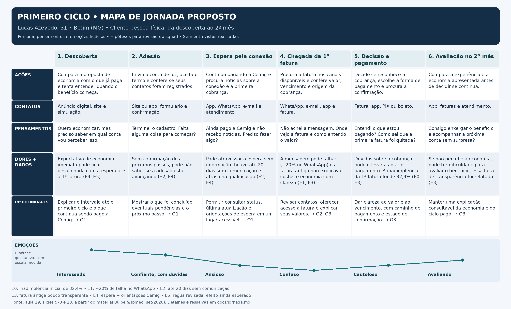

# Mapa de jornada do usuário

> Proposta de jornada v1 para revisão do squad. Persona, pensamentos e emoções são fictícios, criados para o exercício com base no material da disciplina. Não houve entrevista, teste com clientes nem validação do grupo nesta preparação.

## Recorte e objetivo

Cliente pessoa física no primeiro ciclo de relacionamento, da descoberta à avaliação no segundo mês. O foco proposto é diminuir a incerteza durante a espera e facilitar o acesso e a compreensão da primeira fatura. Indicador principal pretendido: pagamento da 1ª fatura. Ainda não há resultado medido da solução.

## Persona

- **Nome e idade:** Lucas Azevedo, 31 anos, personagem fictício
- **Contexto:** mora em Betim (MG), trabalha como técnico de manutenção e procura reduzir uma despesa recorrente da casa. Conheceu a proposta por um anúncio digital e aderiu pelo celular. Os detalhes biográficos são escolhas do exercício, não dados de clientes da Bulbe
- **Objetivo:** entender quando a economia começa, acompanhar o andamento da adesão e pagar a primeira fatura com segurança
- **Medos e dúvidas:** não saber se o cadastro avançou, perder uma cobrança e não compreender a relação entre as contas da Cemig e da Bulbe
- **Canais que usa:** celular como principal acesso, WhatsApp e consulta eventual ao e-mail; disposição para abrir o app quando isso ajudar a acompanhar o serviço. Essas preferências são hipóteses da persona
- **Necessidade central:** consultar o que está acontecendo e o que precisa fazer, sem depender de uma única mensagem

## Como interpretar as evidências

Os dados abaixo vêm da apresentação da aula 19, que atribui os números à apresentação Bulbe & Ibmec de setembro de 2026. Os comportamentos individuais descritos no mapa são hipóteses coerentes com esses dados, não fatos observados em Lucas ou entrevistas realizadas pelo squad. Os números não demonstram sozinhos relações de causa e efeito.

| Código | Local na fonte | Evidência e limite de interpretação |
| --- | --- | --- |
| E0 | Slide 5 | 32,4% de inadimplência acumulada da 1ª fatura entre setembro de 2025 e julho de 2026. É o contexto do problema; não prova a causa de cada atraso. |
| E1 | Slides 7 e 18 | Cerca de 20% das mensagens de WhatsApp falham. A fatura também é enviada por esse canal; bloqueios e números sem WhatsApp lideram as falhas. Não equivale a afirmar que 20% das faturas falham. |
| E2 | Slides 7 e 18 | Clientes chegaram a ficar 20 dias sem comunicação enquanto a régua não estava parametrizada. |
| E3 | Slide 7 | A fatura antiga tinha baixa transparência dos custos e da economia gerada pela Bulbe. |
| E4 | Slides 7 e 8 | Atrasos de qualificação aumentaram a espera pela 1ª fatura. A régua inclui orientações para continuar pagando a Cemig em D+17 e D+40; essas datas não são prazo prometido de conexão. |
| E5 | Slide 6 | A nova régua foi parametrizada em agosto, com efeito esperado a partir de novembro. Os problemas históricos devem orientar hipóteses, sem afirmar que permanecem na mesma intensidade. |

## Mapa

| Fase | Ações | Pontos de contato | Pensamentos | Emoção | Dor com evidência | Oportunidade |
| --- | --- | --- | --- | --- | --- | --- |
| 1. Descoberta | Compara a proposta de economia com o que já paga e tenta entender quando o benefício começa. | Anúncio digital, site e simulação. | Quero economizar, mas preciso saber em qual conta vou perceber isso. | Interessado | Expectativa de economia imediata pode ficar desalinhada com a espera até a 1ª fatura (E4, E5). | Explicar o intervalo até o primeiro ciclo e o que continua sendo pago à Cemig. → O1 |
| 2. Adesão | Envia a conta de luz, aceita o termo e confere se seus contatos foram registrados. | Site ou app, formulário e confirmação. | Terminei o cadastro. Falta alguma coisa para começar? | Confiante, com dúvidas | Sem confirmação dos próximos passos, pode não saber se a adesão está avançando (E2, E4). | Mostrar o que foi concluído, eventuais pendências e o próximo passo. → O1 |
| 3. Espera pela conexão | Continua pagando a Cemig e procura notícias sobre a conexão e a primeira cobrança. | App, WhatsApp, e-mail e atendimento. | Ainda pago a Cemig e não recebo notícias. Preciso fazer algo? | Ansioso | Pode atravessar a espera sem informação: houve até 20 dias sem comunicação e atraso na qualificação (E2, E4). | Permitir consultar status, última atualização e orientações de espera em um lugar acessível. → O1 |
| 4. Chegada da 1ª fatura | Procura a fatura nos canais disponíveis e confere valor, vencimento e origem da cobrança. | WhatsApp, e-mail, app e fatura. | Não achei a mensagem. Onde vejo a fatura e como entendo o valor? | Confuso | A mensagem pode falhar (~20% no WhatsApp) e a fatura antiga não explicava custos e economia com clareza (E1, E3). | Revisar contatos, oferecer acesso à fatura e explicar seus valores. → O2, O3 |
| 5. Decisão e pagamento | Decide se reconhece a cobrança, escolhe a forma de pagamento e procura a confirmação. | Fatura, app, PIX ou boleto. | Entendi o que estou pagando? Como sei que a primeira fatura foi quitada? | Cauteloso | Dúvidas sobre a cobrança podem levar a adiar o pagamento. A inadimplência da 1ª fatura foi de 32,4% (E0, E3). | Dar clareza ao valor e ao vencimento, com caminho de pagamento e estado de confirmação. → O3 |
| 6. Avaliação no 2º mês | Compara a experiência e a economia apresentada antes de decidir se continua. | App, faturas e atendimento. | Consigo enxergar o benefício e acompanhar a próxima conta sem surpresa? | Avaliando | Se não percebe a economia, pode ter dificuldade para avaliar o benefício; essa falta de transparência foi relatada (E3). | Manter uma explicação consultável da economia e do ciclo pago. → O3 |

### Curva emocional

Interesse → confiança com dúvidas → ansiedade → confusão → cautela → avaliação. A curva representa uma hipótese qualitativa sobre a experiência atual da persona. Não é uma medida coletada em pesquisa nem representa o efeito já obtido pela solução.

## Três oportunidades prioritárias propostas

1. **O1: acompanhar a espera com status e próximos passos.** Prioridade por cobrir o silêncio pós-adesão (E2) e a espera longa (E4). Deve esclarecer o que fazer sem inventar um prazo de conexão
2. **O2: localizar a fatura mesmo quando a mensagem falha.** Prioridade por reduzir a dependência do WhatsApp e permitir revisar contatos (E1). Um frontend com dados fictícios poderá demonstrar o fluxo; não comprova envio ou entrega real de mensagens
3. **O3: compreender a primeira cobrança e a economia.** Prioridade por atacar a pouca transparência da fatura antiga (E3), no contexto da inadimplência inicial (E0)

A priorização acima é uma proposta para discussão e pode mudar com o squad. Histórias e critérios de aceite serão desenvolvidos na aula 20, a partir dessas oportunidades.

## Oportunidades registradas como Issues

As três oportunidades foram publicadas com o label `oportunidade`. Permanecem como hipóteses para revisão do squad.

- [#1: acompanhar a espera com status e próximos passos](https://github.com/pedroschott/202602-projeto1-b-05/issues/1)
- [#2: localizar a fatura mesmo quando a mensagem falha](https://github.com/pedroschott/202602-projeto1-b-05/issues/2)
- [#3: compreender a primeira cobrança e a economia](https://github.com/pedroschott/202602-projeto1-b-05/issues/3)

[Quadro do projeto](https://github.com/users/pedroschott/projects/2). O quadro está privado; o acesso do professor precisa ser concluído.

## Fontes

- [Apresentação da aula 19](https://docs.google.com/presentation/d/1v_punRor5o8ZU-v9BN9I9VhaWDtIEyXWVMFbYb-s_Fg/edit), especialmente slides 4–8, 11 e 14–20; consultada em 01/10/2026
- [Roteiro de criação do repositório](https://docs.google.com/document/d/1K9OFyecp78Xt7IMWENCUfc8RL-i-K73yShUDiCTYdSA/edit); consultado em 01/10/2026
